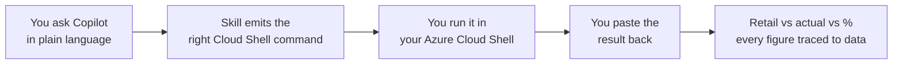

# Actualize

**Know what Azure _actually_ costs you — the price you really pay after negotiated
discounts, reservations, and savings plans — not the sticker price.**

[](LICENSE)
[](https://www.python.org/)
-brightgreen.svg)


Actualize is a **GitHub Copilot skill** (`SKILL.md`, skill name `actualize`). You ask
GitHub Copilot in plain language — _"what are we actually paying for Web-Prod this month?"_ —
and it pulls the right cost data from Azure, does the math, and shows you **retail vs actual
vs the percent difference** for every line item. Every number traces back to real Azure data;
the skill never guesses.

## Contents

- [What it does](#what-it-does)
- [Requirements](#requirements)
- [How it works](#how-it-works)
- [See it in action](#see-it-in-action)
- [Why the numbers are trustworthy](#why-the-numbers-are-trustworthy)
- [Files](#files)
- [Tests](#tests)
- [License](#license)

## What it does

Ask in plain language; Actualize handles the Azure knowledge and the math:

- **Retail vs actual, per line item.** See list price next to what you really paid, with the
  effective discount for each resource and in total.
- **Real savings from proposed cuts.** Paste a table of proposed USD reductions and get the
  _actual_ saving — because a $71 retail cut on a 40%-discounted VM is only worth ~$43.
- **What-if and change analysis.** "What do we save if we delete these three VMs?" or "we scaled
  this database down — what's the actual yearly saving?" — answered from your real spend.
- **Works even on tenants it can't reach.** It emits a copy-paste command you run in **your own**
  Azure Cloud Shell, then reads the result you paste back — no access to your tenant required.
- **Honest by design.** Anything not present in the data is reported as `UNKNOWN` / `UNMATCHED`,
  never invented.

## Requirements

- **Python 3** — standard library only, nothing to `pip install`. (Used by the skill's calculator under the hood.)
- **For live data:** an Azure account with Cost Management / Consumption access, and **Azure Cloud
  Shell** (Bash) to run the command the skill hands you. If you already have exported cost data,
  you can paste that instead.

## How it works

You never touch Azure APIs directly. The skill translates your question into the correct Azure
command for your billing scope, you run it in your own Cloud Shell, and it turns the result into
an apples-to-apples answer.



Because the skill knows Azure — agreement types, billing scopes, the async Cost Details report
flow, API throttling, and how to enrich missing retail prices without guessing — you get a correct
answer without becoming a Cost Management expert yourself.

## See it in action

Real output from the skill. The first example is expanded; the rest are collapsed — click to open.

> **You:** For subscription _Web-Prod_, what did we actually pay in June vs list price?
>
> **`actualize`:** I can't reach your tenant from here — run this in **Azure Cloud Shell** (Bash)
> and paste the output back:
> ```bash
> az consumption usage list --start-date 2026-06-01 --end-date 2026-06-30 \
>   --include-meter-details --include-additional-properties -o json
> ```
>
> **You:** _(pastes the JSON)_
>
> **`actualize`:** Here's retail vs actual — a **22.5%** effective discount overall:
>
> | Item | Retail (USD) | Actual (USD) | Savings | Discount % |
> |---|--:|--:|--:|--:|
> | egress-westus | 43.50 | 43.50 | 0.00 | 0.0% |
> | vm-app01 | 71.42 | 42.85 | 28.57 | 40.0% |
> | stproddata01 | 18.40 | 17.00 | 1.40 | 7.6% |
> | **TOTAL** | **133.32** | **103.35** | **29.97** | **22.5%** |
>
> `vm-app01` carries the discount (40%); egress gets none. Want this grouped by service instead?

<details>
<summary><strong>"Why does my cost export show no discounts?"</strong></summary>

> **You:** _(pastes a Cost Details CSV)_ This shows actual cost but no savings — why?
>
> **`actualize`:** Your export has actual cost but the list-price field is `0`, so retail is
> `UNKNOWN`. I'll enrich retail from the public **Azure Retail Prices API** by meter — without
> guessing on meters that map to multiple SKUs. Two meters resolved cleanly; the SQL vCore meter
> is **ambiguous** (it maps to 1–80 vCore at different prices), so I'm leaving it `UNKNOWN`:
>
> | Item | Retail (USD) | Actual (USD) | Discount % | Note |
> |---|--:|--:|--:|---|
> | sql-db01 | UNKNOWN | 100.00 | n/a | ambiguous meter — not guessed |
> | vm-app01 | 71.42 | 42.85 | 40.0% | retail via Retail Prices API |
> | stproddata01 | 18.40 | 17.00 | 7.6% | retail via Retail Prices API |
>
> The blended total is flagged _retail incomplete_ because retail covers fewer rows than actual.
> Tell me the SQL SKU (e.g. "8 vCore") and I'll use that exact price to finish the row.

</details>

<details>
<summary><strong>"Finance sent proposed cuts — what do they actually save?"</strong></summary>

> **You:** Here's a list of monthly reductions someone proposed. What's the real saving? _(pastes
> a markdown table)_
>
> **`actualize`:** Those are **retail** cuts; the actual saving depends on each resource's real
> discount, from your cost data:
>
> | Item | Retail reduction | Actual/Retail | Actual reduction | Match basis |
> |---|--:|--:|--:|---|
> | vm-app01 | 71.42 | 60.0% | 42.85 | exact |
> | stproddata01 | 9.20 | 92.4% | 8.50 | exact |
> | some-unmanaged-thing | 50.00 | **UNMATCHED** | UNKNOWN | no match in cost data |
> | **TOTAL** | **80.62** | n/a | **51.35** | _some UNMATCHED — not counted_ |
>
> The $71.42 cut on `vm-app01` is worth **$42.85** actual (it's at a 40% discount).
> `some-unmanaged-thing` isn't in your cost data, so I left it out — send me its usage to include it.

</details>

<details>
<summary><strong>"If we delete these, what's the monthly saving?"</strong></summary>

> **You:** What's the run-rate saving if we remove vm1, stor1 and kv1?
>
> **`actualize`:** From their actual spend over the period (normalized to a monthly run-rate):
>
> | Resource | Chg actual (USD) | Proj. change/mo if removed | Status |
> |---|--:|--:|---|
> | vm1 | -60.00 | -608.75 | RUN-RATE |
> | stor1 | -30.00 | -304.38 | RUN-RATE |
> | kv1 | -6.00 | -60.88 | RUN-RATE |
> | **TOTAL** | **-96.00** | **-974.00** | |
>
> About **$974/mo**. Caveat: if any is covered by a reservation or savings plan, the cash saving
> lags until that commitment is reallocated or expires — I won't overstate it. Given a _before_
> and _after_ period instead, I'll show the exact change per resource (REMOVED/CHANGED/ADDED).

</details>

<details>
<summary><strong>"We scaled a resource down — what's the actual <em>yearly</em> saving?"</strong></summary>

> **You:** We dropped these SQL databases from 4 to 2 vCore. What do we actually save per year?
>
> **`actualize`:** First I date the change (it's a SKU _update_, not a delete). A repo/PR merge date
> isn't the deploy date — staged rollouts land region-by-region days later, so a
> geo-replicated pair changes on _different days_. I confirm each region's exact change via Azure
> Resource Graph change history (the size/SKU field varies by resource type — here `sku.capacity`
> 4→2), then pull actual cost for a window fully before the first change and fully after the last,
> and run `delta --annual`. The result is one row per resource plus a **TOTAL**, with columns for
> the resource, its before/after actual cost, the raw change, the monthly run-rate change
> (`Chg actual/mo`), the annualized change (`Chg actual/yr`), the percent change, and a status.
>
> The change columns come straight from the pasted actual-cost windows (`/mo` is normalized to a
> monthly run-rate); the `/yr` column is that run-rate × 12 — a forward-looking projection valid
> while usage and pricing hold, not measured actuals. I lead with the actual figure and, if asked,
> show the retail / list price only as a separately labeled cross-check.

</details>

## Why the numbers are trustworthy

**The one rule: never guess.** Every retail number, actual number, and percentage comes from data
you pasted back from Azure — or, for retail only, the anonymous Azure Retail Prices API as a labeled
cross-check. If a value isn't in the data, the cell is `UNKNOWN` / `UNMATCHED`.

Retail and actual are pulled from the **same Cost Management line item**, so the comparison is
apples-to-apples:

- **Retail** = `ListCost` (FOCUS) or `payGPrice × quantity`
- **Actual** = `EffectiveCost` / `costInBillingCurrency` / `pretaxCost`
- **Discount %** = `1 − actual ÷ retail`

Comparison is on **amortized cost over a period**, which automatically accounts for quantity, tiers,
reservations, and savings plans — more accurate than reconstructing hourly rates.

**Currency.** A currency found in the data (`billingCurrency`) is always used; genuinely
mixed-currency data is never coerced or summed — it stays `MIXED(...)`. Where no currency is
present, amounts default to **USD** as a label-only assumption that never alters a cost.

## Files

| Path | Purpose |
|---|---|
| `SKILL.md` | The GitHub Copilot skill: workflow, intent handling, and Cloud Shell command tiers |
| `scripts/actualize.py` | Deterministic retail-vs-actual + savings + delta calculator (stdlib only) |
| `scripts/fetch_retail.py` | Ambiguity-safe retail list-price fetch by meterId (stdlib only) |
| `samples/` | Fixtures for every input shape, incl. `zeroed-retail.json` + `retail-map.csv` (enrichment) |
| `tests/test_actualize.py` | Deterministic unit tests (stdlib `unittest`, no third-party deps) |

## Tests

```bash
python tests/test_actualize.py
```

## License

This project is licensed under the [MIT License](LICENSE) — © 2026 Microsoft.
